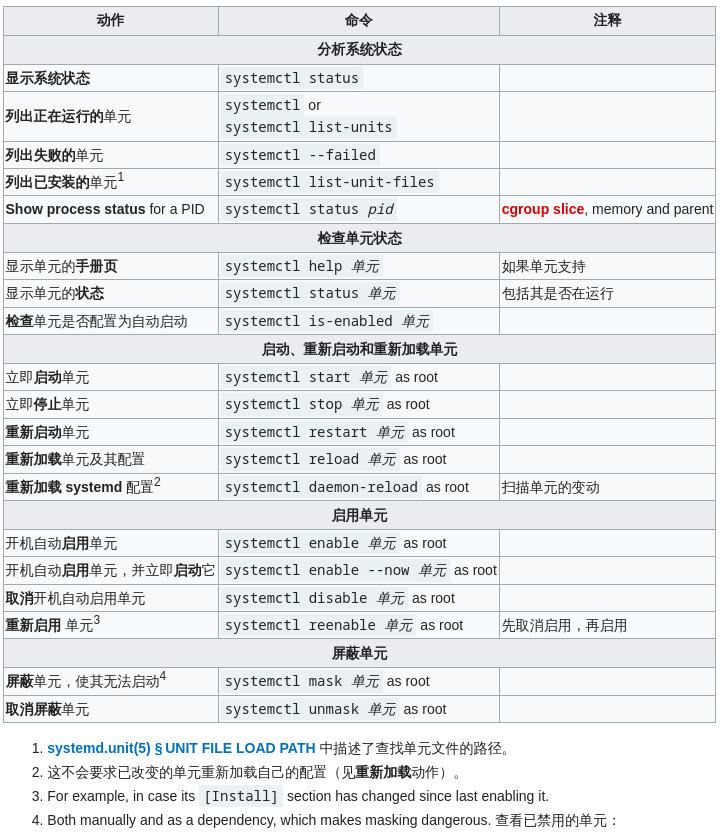

+++
title = 'Systemd'
date = 2023-09-09T15:18:45+08:00
draft = false
tags = ["notes"]
searchHidden = false
showToc = true
author = ["zhxqian3"]
summary = "个人关于systemd的使用笔记"
+++

## 用户模式下的目录

```
~/.config/systemd/user/
```

## 系统模式下的目录

```
/usr/lib/systemd/system/ ：软件包安装的单元
/etc/systemd/system/ ：系统管理员安装的单元
```

## 简单设置(用户模式)

```
[Unit] 
Description=Foo 
[Service] 
ExecStart=/usr/sbin/foo-daemon 
[Install] 
WantedBy=default.target
```

## 简单设置(系统模式)

```
[Unit] 
Description=Foo 
[Service] 
ExecStart=/usr/sbin/foo-daemon 
[Install] 
WantedBy=multi-user.target
```

## 定时任务

- 后缀名为`.timer`的单元文件。
- 对应的`.service`文件中不需要包含 `[Install]` 部分，因为这由`timer`单元接管。

### 简单示例(单调定时器)

定义一个在系统启动 15 分钟后执行，且之后每3天都执行一次的定时器：

```
[Unit]
Description=Run foo weekly and on boot

[Timer]
OnBootSec=15min
OnUnitActiveSec=3d 

[Install]
WantedBy=timers.target
```

时间单位：

- usec, us, µs
- msec, ms
- seconds, second, sec, s
- minutes, minute, min, m
- hours, hour, hr, h
- days, day, d
- weeks, week, w
- months, month, M (defined as 30.44 days)
- ears, year, y (defined as 365.25 days)

### 简单示例(实时定时器)

定义一个每周执行一次（具体来讲，指周一凌晨零点）的定时器。如果上次未执行（比如说系统当时没有开机，这个行为由 `Persistent=true` 定义）就立即执行服务。

```
[Unit]
Description=Run foo weekly

[Timer]
OnCalendar=weekly
Persistent=true

[Install]
WantedBy=timers.target
```

每天到点运行：
```
[Unit]
Description=Run foo service at 16:00 every day

[Timer]
OnCalendar=*-*-* 16:00:00
Persistent=true

[Install]
WantedBy=timers.target
```

## 常用命令解释



## 寻找错误

1.  通过 systemd 寻找启动失败的服务:

```
 systemctl --state=failed
```

或者使用 systemd 消息:

```
journalctl -fp err
```

2.  我们发现了启动失败的 `systemd-modules-load` 服务. 我们想知道更多信息:

```
systemctl status systemd-modules-load
```

如果没列出 `Process ID`, 通过 `systemctl` 重新启动失败的服务 ( 例如 `systemctl restart systemd-modules-load` )
3\. 现在得到了 PID ,你就可以进一步探查错误的详细信息了.通过下列的命令收集日志,PID 参数是你刚刚得到的 `Process ID` (例如 15630):

```
journalctl -b _PID=15630
```

修改错误后重新启动服务，看是否正常运行。

**==若为用户模式==**：
若调取日志，则要指定一个单位，可以使用：

```
journalctl --user-unit myunit.service
```

或者，等效地：

```
journalctl --user -u myunit.service
```

注意： journald 不会为 UID 低于 1000 的用户编写用户日志，而是将所有内容定向到系统日志。